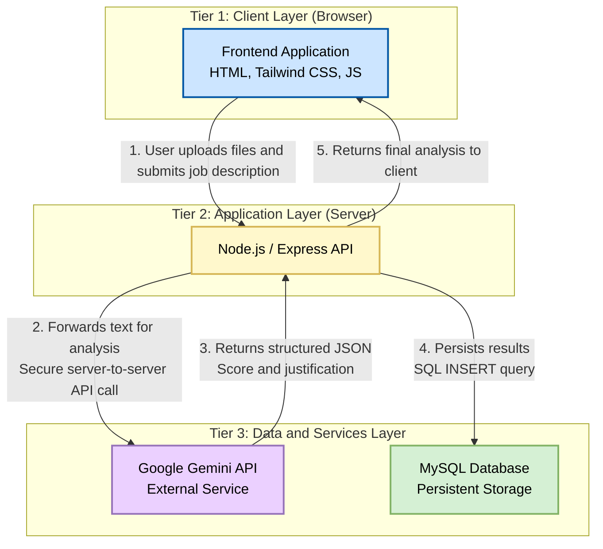

### AI-Powered Resume Screener & Job Match Engine
An intelligent, full-stack application designed to automate and enhance the technical recruitment pipeline by leveraging Large Language Models for deep semantic analysis of resumes against job descriptions.
## 1. **Executive Overview**
In today's competitive hiring landscape, recruiters spend countless hours manually sifting through resumes. This process is often inefficient, prone to bias, and doesn't always identify the best-fit candidates.
This project solves that problem by providing an automated solution that goes beyond simple keyword matching. It uses the Google Gemini LLM to understand the context, skills, and experience outlined in a resume and provides a quantitative score and a qualitative, evidence-based justification for each candidate's fit. This allows hiring managers to instantly surface the most promising applicants and make more informed decisions.
## 2. **Key Features**
- Multi-File Processing: Ingest and analyze multiple candidate resumes (.pdf, .txt) in a single batch.
- Semantic Matching: Utilizes an LLM to understand the nuances of skills and experience, not just keywords.
- Quantitative Scoring: Delivers a clear, numerical score (1-10) for at-a-glance candidate comparison.
- AI-Generated Justification: Provides a concise, professional summary explaining why a candidate received a certain score, highlighting specific strengths and gaps.
- Persistent Storage: Archives all screening results in a MySQL database for auditing and record-keeping.
Decoupled Architecture: Built with a scalable and secure client-server model.
Perfect — you’re trying to document your **three-tier system architecture** and include a **diagram** in Markdown.

On GitHub, standard Markdown **doesn’t render HTML `<div>` styling inside Mermaid diagrams**, but **Mermaid syntax itself works**. We can simplify your Mermaid diagram so it renders correctly on GitHub and still conveys all your information.

Here’s a GitHub-compatible version:

---

Perfect! ✅ I’ve rewritten your **System Architecture section** fully in **GitHub-compatible Markdown with Mermaid diagrams**.

You can **copy and paste this directly into your README.md**, and it will render cleanly without errors.

---

## 3. System Architecture

The application is built on a robust, decoupled **Three-Tier Architecture** to ensure security, scalability, and maintainability.
The backend acts as a trusted intermediary, ensuring that sensitive credentials like API keys are never exposed to the client.

---

### Architecture Diagram





###  Tier Descriptions

* **Tier 1: Client Layer (Browser)**
  Handles the user interface using **HTML, Tailwind CSS, and JavaScript**. Users upload resumes and submit job descriptions here.

* **Tier 2: Application Layer (Server)**
  Implements business logic and secure communication with external services. Built using **Node.js and Express.js**. This layer ensures that sensitive data (like API keys) never reaches the client.

* **Tier 3: Data and Services Layer**

  * **Google Gemini API:** Performs semantic analysis and scoring of resumes.
  * **MySQL Database:** Stores all screening results for record-keeping and future analysis.

---

###  Workflow Summary

1. User uploads resumes and submits a job description.
2. Server receives the request and forwards the text to Google Gemini API.
3. The API returns a structured JSON containing the **compatibility score** and **justification**.
4. Server stores the results in the **MySQL database**.
5. Final analysis is returned to the client for display.

---


## 4. **LLM Prompt Engineering: The Core Logic**
The quality of the AI's analysis is entirely dependent on the quality of the prompt. A simple "compare this" prompt is insufficient. We employ a structured prompting methodology to ensure reliable, accurate, and parsable results.
## The Prompt Template
```bash
As a Senior Technical Recruiter with 15 years of experience, your task is to analyze the following resume against the provided job description. Your analysis must be objective, focusing purely on the alignment of skills, experience, and qualifications.

Provide your output ONLY in a valid JSON format, with no additional text or explanations before or after the JSON object. The JSON object must contain two keys: "score" and "justification".

1.  "score": An integer from 1 to 10, where 1 represents no match and 10 represents a perfect match.
2.  "justification": A concise, professional paragraph (3-4 sentences) explaining the reasoning behind the score. Highlight key strengths and note any significant gaps or missing qualifications.

---
Job Description:
{job_description}
---
Resume:
{resume_text}
---
```

## Prompt Design Principles
- Role-Playing: The prompt begins by assigning a persona ("As a Senior Technical Recruiter..."). This puts the LLM into a specific context, priming it to produce a more professional and relevant analysis.
- Structured Output Mandate: We explicitly instruct the model to return only a valid JSON object. This is critical for reliability, as it allows our server.js backend to parse the LLM's response predictably using JSON.parse() without complex string manipulation.
- Zero-Shot Chain-of-Thought: By requiring a "justification", we compel the model to perform a logical reasoning process. It must first analyze the documents, then form a conclusion (the justification), and finally derive the score from that conclusion. This improves the accuracy of the score.
- Clear Delimiters: Using --- to separate the prompt instructions from the user-provided data is a security and clarity best practice. It prevents ambiguity and potential prompt injection, ensuring the model clearly understands which part is the instruction and which part is the data to be analyzed.
## 5. Technology Stack
| **Tier**              | **Technology**                 | **Purpose**                                       |
| --------------------- | ------------------------------ | ------------------------------------------------- |
| **Frontend**          | HTML, Tailwind CSS, JavaScript | User Interface & Client-Side Logic                |
| **Backend**           | Node.js, Express.js            | API Server, Business Logic, Service Orchestration |
| **Database**          | MySQL                          | Persistent Storage for Screening Results          |
| **AI Service**        | Google Gemini API              | Semantic Analysis & Scoring                       |
| **Development Tools** | Git, npm, VS Code              | Version Control, Package Management, IDE          |

---

## 6. Local Setup and Deployment

###  Prerequisites

Ensure the following are installed and configured:

* **Node.js (v18.x or later)** & npm
* **MySQL Server** & MySQL Workbench
* **Git** installed and configured

---

###  Installation Steps

1. **Clone the repository:**

   ```bash
   git clone https://github.com/your-username/ai-resume-screener.git
   cd ai-resume-screener
   ```

2. **Install backend dependencies:**

   ```bash
   npm install
   ```

3. **Database Setup:**

   * Connect to your **MySQL instance**.
   * Create a new schema (database) named:

     ```sql
     CREATE DATABASE resume_screener;
     ```
   * Execute the following SQL DDL script to create the required table:

     ```sql
     CREATE TABLE screening_results (
         id INT AUTO_INCREMENT PRIMARY KEY,
         candidate_name VARCHAR(255) NOT NULL,
         match_score INT NOT NULL,
         justification TEXT,
         job_description TEXT,
         created_at TIMESTAMP DEFAULT CURRENT_TIMESTAMP
     );
     ```

4. **Configuration:**

   * In `server.js`, update the `mysql.createConnection` object with your **MySQL username and password**.
   * In `server.js`, add your **Google Gemini API key** to the designated constant.

---

###  Running the Application

1. **Start the backend server:**

   ```bash
   node server.js
   ```

   The server will be running at:
    [http://localhost:3000](http://localhost:3000)

2. **Launch the frontend:**

   * Open the `index.html` file directly in your web browser.

---


